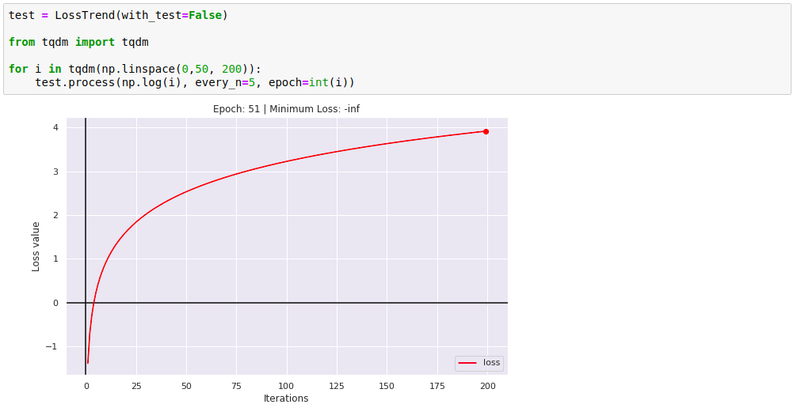
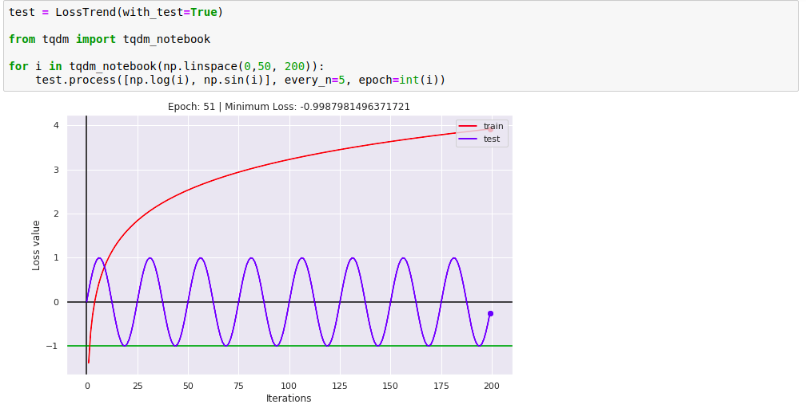

# LossTrend

### Idea

Small script which uses matplotlib and IPython to show a fine trend lines.

Main idea was to made easy instrument for ML and DS guys which provides showing Train and Test Loss value while training your SuperUltraNET.

### Examples

Programm can plot ether one line (for example train) or two lines (train/test)

One Line:

Two Lines:

